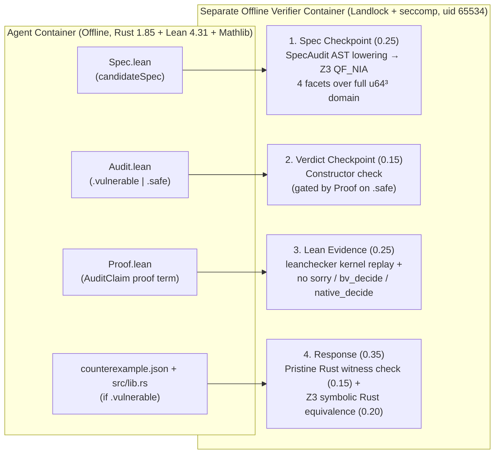

# Rust Security Verification Harbor — Lean 4.31 Symmetric Challenge Benchmark

A **Lean-native, symmetric Harbor 0.9.0 benchmark** evaluating whether frontier coding agents can formally specify real-world `u64` Rust arithmetic in Lean 4.31, determine whether the implementation universally conforms to its mathematical contract over all $2^{64} \times 2^{64} \times 2^{64}$ inputs, and prove that verdict.

## TL;DR for Reviewers

1. **Symmetric Blind Pairs (`vulnerable` / `safe` with byte-identical prompts):** Every problem comes as two Harbor tasks with **byte-identical `instruction.md`** and passing unit tests. One variant contains a subtle unsigned arithmetic bug (`CWE-190` / `CWE-682`); the other is universally sound. Guessing `.safe` or `.vulnerable` cannot score well across a pair.
2. **6 Non-Redundant Challenge Pairs (`12` Harbor tasks):**
   - **1 Multi-Module Engine with Realistic Noise (`settlement-engine`)**: ~330 lines of Rust / ~180 lines of Lean across 6 modules and 14 functions (including 6 sound fee/rebate calculators acting as red herrings), hiding an interior carry-pocket off-by-one of width `8,383` out of $2^{64}$ (exact at `u64::MAX`).
   - **5 Production Arithmetic Kernels (Non-Web3 & Web3/ZK)**: real bit-manipulation, modular reduction, and multiprecision division kernels extracted from upstream crates (`tov/succinct-rs`, `alloy-rs/ruint`, `Plonky3/Plonky3`, `orca-so/whirlpools`, `recmo/goldilocks`).
3. **100% Automatic, Fail-Closed Verification (`[0, 1]`):** An isolated, network-disabled verifier container grades submissions across **4 independent checkpoints**—semantic Z3 equivalence of `Spec.lean` over `u64^3` (`0.25`), `Audit.lean` verdict (`0.15`), sandboxed `leanchecker` + transitive-axiom audit of `Proof.lean` (`0.25`), and concrete Rust counterexample + Z3-proven universal Rust repair (`0.35`). **Model text is never compared.**
4. **10-Turn Default Horizon (`max_turns=10`) vs. 25-Turn Extended Horizon (`max_turns=25`):**
   - **At 10 turns (default benchmark budget):** Both **Claude Opus 5.5 (`high`)** and **GPT 6.1 Sol (`high`)** solve **6/6 `.vulnerable` tasks (`1.00`)**, but universal Lean 4 `.safe` proofs create a sharp bottleneck—Opus 5.5 scores **`0.688`** (`2/6` `.safe` proofs closed in $\le 10$ turns) and GPT 6.1 Sol scores **`0.625`** (`0/6` `.safe` proofs closed in $\le 10$ turns).
   - **At 25 turns (extended horizon):** **Claude Opus 5.5 (`high`)** reaches **`1.000` (`12/12`)**, whereas **GPT 6.1 Sol (`high`)** reaches **`0.813` (`9.75/12`)**, failing at **`0.25`** on the three hardest universal proofs (`ruint-safe`, `succinct-safe`, `plonky3-safe`).



---

## Challenge Benchmark Suite (6 Symmetric Pairs = 12 Harbor Tasks)

By default (`python3 scripts/make-family.py /tmp/security-family`), the generator emits the **6 non-redundant Challenge pairs** below:

| Pair (`-vulnerable` / `-safe`) | Domain & Upstream Origin | Mathematical Debit $S(\text{amount}, \text{fee})$ | Bug in `.vulnerable` (and why it is non-obvious) |
|---|---|---|---|
| **[`ruint`](problems/ruint)** | **Web3 Multiprecision** — `alloy-rs/ruint` (`algorithms/div/small.rs`: `div_2x1_mg10`) | $\lfloor \text{amount}/2 \rfloor + \lfloor (((\text{fee} \bmod 32771) \cdot 2^{16} + (\text{amount} \bmod 2^{16})) / 32771 \rfloor$ | Möller-Granlund 2-by-1 reciprocal division (`D = 0x8003`, `V = 0xFFF4`) omits the second conditional remainder correction `if r_corr >= D`, under-estimating the quotient by `1` only when `r_corr ∈ [D, 2D)`. |
| **[`succinct`](problems/succinct)** | **Non-Web3 SWAR / Bitmaps** — `tov/succinct-rs` (`src/broadword.rs`: `u_nz8`, `count_nz_bytes`, `sum_bytes`) | $\lfloor \text{amount}/2 \rfloor + \sum_{i=0}^7 b_i(\text{fee}) + 256 \cdot \|\{i \mid b_i(\text{fee}) > 0\}\|$ | Vigna's SWAR broadword non-zero byte detector `(((x \| H8) - L8) \| x) & H8` omits `\| x`, silently treating every byte equal to `0x80` (`128`) as zero. |
| **[`plonky3`](problems/plonky3)** | **Web3 / ZK Field Math** — `Plonky3/Plonky3` (`monty-31/src/utils.rs`: `to_monty_64` + `monty_reduce`, $P = 2\,013\,265\,921$) | $\text{amount} + (((\text{amount} \bmod 2^{32}) + (\text{fee} \bmod P) \cdot 2^{32}) \cdot 943\,718\,400 \bmod P)$ | 64-bit BabyBear Montgomery reduction (`MU = 2_281_701_377`) adds `(1 << 32) - P` instead of `P` in the unsigned underflow branch after shifting by 32 bits. |
| **[`settlement-engine`](problems/settlement-engine)** | **Multi-Module Engine + Noise** — 6 modules, 7 structs, 14 functions (~330 lines Rust / ~180 lines Lean) | $\text{amount} + (\lceil (\text{amount}+\text{fee})/10\,000 \rceil - \lfloor \lceil (\text{amount}+\text{fee})/10\,000 \rceil / 10 \rfloor)$ | Pure-`u64` carry-folding across `fold_u64_sum` and `ceil_div_bps_folded` is exact at `u64::MAX`, but under-computes the fee by `1` inside the interior pocket $2^{64}-9\,999 \le \text{amount}+\text{fee} \le 2^{64}-1\,617$, surrounded by 6 sound sibling calculators. |
| **[`whirlpool`](problems/whirlpool)** | **Web3 / DeFi AMM Math** — `orca-so/whirlpools` (`math/u256_math.rs`: 4-limb base-$2^{32}$ `U128Muldiv::div`) | $\lfloor \text{amount}/2 \rfloor + \lceil (\text{amount} + \text{fee} \cdot 2^{64}) / 1\,000\,000 \rceil$ | 4-limb base-$2^{32}$ ceiling division omits the `w1 → w2` carry propagation in `add_carry` when `q0 = 2^32 - 1`, `q1 = 2^32 - 1` and `rem > 0`, wrapping a $2^{64}$ quotient to `0`. |
| **[`goldilocks`](problems/goldilocks)** | **Web3 / ZK Field Math** — `recmo/goldilocks` (`field/algo/generic.rs`: `reduce_128`, $P = 2^{64}-2^{32}+1$) | $\lfloor \text{amount}/2^{32} \rfloor + ((\text{amount} + \text{fee} \cdot 2^{64}) \bmod P)$ | Two-step 128-bit Goldilocks reduction checks `> P` instead of `>= P` in the final canonicalization step, leaving a single unreduced residue `r = P`. |

> [!NOTE]
> **Auxiliary calibration & regression pairs (`--problem all`):** The repository also retains 4 simpler or intermediate calibration pairs used by `scripts/selftest.py`—`authorization` (initial 40-line `wrapping_add` PoC), `settlement` and `settlement-modular` (Level 0 and Level 1 isolation precursors to `settlement-engine`), and `openpql` (4-level mixed-radix indexing from `solve-poker/Poker-Query-Language`).

---

## Agent Contract & Scoring (`[0, 1]`)

**Environment:** Offline container (`allow_internet = false`) with Rust 1.85, Lean 4.31.0, prebuilt `Mathlib` (`Batteries`, `Aesop`, `Qq`, `Std`, `Init`) in `/opt/rvb-deps`, `/workspace/challenge` (Rust crate), `/workspace/lean/SecurityChallenge.lean` (visible Lean model & `AuditClaim`), and `python3 /workspace/lean/check.py`.

| Checkpoint | Weight | Artifact(s) in `/workspace/submission/` | Verification Mechanism |
|---|---:|---|---|
| **1. Specification** | **`0.25`** | `Spec.lean` (`candidateSpec : AuthorizationSpec`) | `SpecAudit.lean` lowers elaborated `accepts` and `output` expressions to Z3 (`QF_NIA` with Euclidean quotient/remainder purification) over all `u64` inputs. `0.0625` per facet: **(1) Safety** (`accepts → S ≤ balance`), **(2) Completeness** (`S ≤ balance → accepts`), **(3) Output exactness & uniqueness**, **(4) Non-vacuity & existence**. |
| **2. Verdict** | **`0.15`** | `Audit.lean` (`verdict : AuditVerdict`) | `.vulnerable` or `.safe`. On `.safe`, credit requires a valid Lean proof and pristine Rust conformance so guessing `.safe` earns `0.00`. |
| **3. Lean Evidence** | **`0.25`** | `Proof.lean` (proof term of `AuditClaim candidateSpec verdict`) | Compiled in a fresh Landlock+seccomp sandbox (`uid 65534`), replayed by `leanchecker`, and audited with `loadExts := false`. Only standard axioms (`propext`, `Classical.choice`, `Quot.sound`) are allowed (`sorry`, `axiom`, `native_decide`, and `bv_decide` trust axioms are rejected). |
| **4. Response** | **`0.35`** | Vulnerable: `counterexample.json` (`0.15`) + `src/lib.rs` (`0.20`)<br/>Safe: *both files must be absent* | Vulnerable: pristine Rust binary must violate the contract on `counterexample.json`, and `rust_symbolic.py` proves universal equivalence of `src/lib.rs` via Z3 over `u64^3` + compiled `rustc -O` probes. Safe: same conditions as Verdict + no spurious witness/patch files. |

---

## Benchmark Results: 10-Turn Default Horizon vs. 25-Turn Extended Horizon

We evaluate models with Harbor 0.9.0 (`terminus-2`, `reasoning_effort=high`) under two turn budgets:
- **Default Benchmark Horizon (`--ak max_turns=10`):** The standard budget recommended for benchmarking. Ten turns are sufficient to audit, refute, and patch all `.vulnerable` tasks, while testing whether a model can construct universal Lean 4 proofs without brute-force trial-and-error.
- **Extended Horizon (`--ak max_turns=25`):** A 2.5× larger turn budget used to measure each model's asymptotic formal-proof ceiling.

### Summary Across the 12 Challenge Tasks (6 Symmetric Pairs)

| Metric | Claude Opus 5.5 (`high`) @ **10 turns** | Claude Opus 5.5 (`high`) @ **25 turns** | GPT 6.1 Sol (`high`) @ **10 turns** | GPT 6.1 Sol (`high`) @ **25 turns** |
|---|---:|---:|---:|---:|
| **`.vulnerable` tasks (`6` tasks)** | **1.000** (`6.00 / 6`) | **1.000** (`6.00 / 6`) | **1.000** (`6.00 / 6`) | **1.000** (`6.00 / 6`) |
| **`.safe` tasks (`6` tasks)** | **0.375** (`2.25 / 6`) | **1.000** (`6.00 / 6`) | **0.250** (`1.50 / 6`) | **0.625** (`3.75 / 6`) |
| **Overall Challenge Mean (`12` tasks)** | **0.688** (`8.25 / 12`) | **1.000** (`12.00 / 12`) | **0.625** (`7.50 / 12`) | **0.813** (`9.75 / 12`) |

### Per-Task Breakdown (12 Challenge Tasks)

| Task | Variant | Opus 5.5 @ **10T** | Opus 5.5 @ **25T** | Opus 5.5 Turns | Opus 5.5 Tokens (`in` + `out`) | GPT 6.1 Sol @ **10T** | GPT 6.1 Sol @ **25T** | GPT 6.1 Sol Turns | GPT 6.1 Sol Tokens (`in` + `out`) |
|---|---|---:|---:|---:|---:|---:|---:|---:|---:|
| `ruint-vulnerable` | `.vulnerable` | **1.00** | **1.00** | 9 | 107.3k (95.8k + 11.5k) | **1.00** | **1.00** | 10 | 84.2k (80.6k + 3.6k) |
| `ruint-safe` | `.safe` | **0.00** | **1.00** | 23 | 665.6k (606.7k + 58.9k) | **0.25** | **0.25 ❌** | 25 | 671.7k (661.5k + 10.2k) |
| `succinct-vulnerable` | `.vulnerable` | **1.00** | **1.00** | 9 | 116.7k (106.5k + 10.2k) | **1.00** | **1.00** | 7 | 58.5k (54.8k + 3.6k) |
| `succinct-safe` | `.safe` | **0.00** | **1.00** | 15 | 572.9k (519.2k + 53.7k) | **0.25** | **0.25 ❌** | 25 | 745.1k (735.4k + 9.7k) |
| `plonky3-vulnerable` | `.vulnerable` | **1.00** | **1.00** | 7 | 91.4k (78.4k + 13.0k) | **1.00** | **1.00** | 10 | 83.1k (79.0k + 4.2k) |
| `plonky3-safe` | `.safe` | **0.00** | **1.00** | 16 | 490.2k (427.5k + 62.7k) | **0.25** | **0.25 ❌** | 25 | 537.2k (528.5k + 8.7k) |
| `settlement-engine-vulnerable` | `.vulnerable` | **1.00** | **1.00** | 12 *(done T8)* | 218.3k (203.6k + 14.7k) | **1.00** | **1.00** | 12 *(done T9)* | 146.3k (142.0k + 4.4k) |
| `settlement-engine-safe` | `.safe` | **0.25** | **1.00** | 20 | 354.7k (326.2k + 28.5k) | **0.25** | **1.00** | 25 | 582.2k (574.3k + 8.0k) |
| `whirlpool-vulnerable` | `.vulnerable` | **1.00** | **1.00** | 7 | 90.8k (79.6k + 11.2k) | **1.00** | **1.00** | 10 | 92.6k (88.3k + 4.3k) |
| `whirlpool-safe` | `.safe` | **1.00** | **1.00** | 11 *(done T9)* | 260.1k (207.8k + 52.3k) | **0.25** | **1.00** | 21 | 573.1k (562.7k + 10.5k) |
| `goldilocks-vulnerable` | `.vulnerable` | **1.00** | **1.00** | 7 | 91.4k (79.5k + 12.0k) | **1.00** | **1.00** | 9 | 73.7k (69.6k + 4.0k) |
| `goldilocks-safe` | `.safe` | **1.00** | **1.00** | 10 | 374.9k (318.9k + 56.0k) | **0.25** | **1.00** | 25 | 530.0k (520.2k + 9.8k) |

<details>
<summary><strong>Auxiliary Calibration & Regression Tasks (4 pairs = 8 tasks, <code>--problem all</code>)</strong></summary>

| Task | Category | Opus 5.5 @ 25T | Opus 5.5 Turns / Tokens | GPT 6.1 Sol @ 25T | GPT 6.1 Sol Turns / Tokens |
|---|---|---:|---:|---:|---:|
| `settlement-vulnerable` | Level 0 — Isolated kernel | **1.00** | 11 turns / 139.5k | **1.00** | 11 turns / 90.4k |
| `settlement-safe` | Level 0 — Isolated kernel | **1.00** | 13 turns / 231.2k | **1.00** | 19 turns / 228.4k |
| `settlement-modular-vulnerable` | Level 1 — 4-module pipeline | **1.00** | 7 turns / 95.4k | **1.00** | 11 turns / 105.5k |
| `settlement-modular-safe` | Level 1 — 4-module pipeline | **1.00** | 15 turns / 309.1k | **1.00** | 25 turns / 519.4k |
| `openpql-vulnerable` | Non-Web3 mixed-radix indexing | **1.00** | 7 turns / 94.9k | **1.00** | 7 turns / 58.8k |
| `openpql-safe` | Non-Web3 mixed-radix indexing | **1.00** | 8 turns / 145.6k | **1.00** | 15 turns / 286.6k |
| `authorization-vulnerable` | Initial 40-line `wrapping_add` PoC | *(GLM 5.3 Flash: **1.00**)* | *(181.3k tokens)* | — | — |
| `authorization-safe` | Initial 40-line `checked_add` PoC | *(GLM 5.3 Flash: **1.00**)* | *(301.8k tokens)* | — | — |

</details>

---

## Running the Benchmark

Requirements: Docker with Compose v2, Python 3.12+, and access to the pinned base images.

```bash
git clone https://github.com/Th0rgal/rust-security-verification-harbor
cd rust-security-verification-harbor
python3 -m venv .venv && .venv/bin/pip install -r scripts/harbor-requirements.lock

# Generates the 6 Challenge Benchmark pairs (12 Harbor tasks) by default.
# Pass `--problem all` to generate all 10 pairs (20 tasks).
python3 scripts/make-family.py /tmp/security-family

# Standard 10-turn evaluation across the 6 Challenge pairs (12 tasks):
for p in settlement-engine goldilocks whirlpool plonky3 succinct ruint; do
  for v in vulnerable safe; do
    .venv/bin/harbor run -p /tmp/security-family/$p-$v \
      -a terminus-2 -m <model> \
      --ak reasoning_effort=high --ak max_turns=10 \
      -e docker -n 1
  done
done
```

### Oracle Smoke Check & Adversarial Selftest

```bash
# Harbor E2E oracle check on the 6 Challenge pairs (asserts 1.00 and identical prompts):
.venv/bin/python scripts/harbor-smoke.py --harbor .venv/bin/harbor --output /tmp/v3-e2e

# Offline adversarial regression suite across all 10 pairs / 20 variants:
docker build -t security-verifier:v3-review -f task/tests/Dockerfile task/tests
docker run --rm --network none -v "$PWD:/repo" -e VERIFIER_ROOT=/opt/security-verifier \
  security-verifier:v3-review python3 /repo/scripts/selftest.py   # ends with "selftest v3: PASS"
```

---

## Trust Boundary & Repository Layout

- **Trust boundary:** Lean theorems certify `candidateSpec` against the visible model (`SecurityChallenge.lean`). Repaired Rust (`src/lib.rs`) is verified over all `u64` inputs by the Z3 symbolic executor (`rust_symbolic.py`) plus compiled `rustc -O` probes. Full backend details are in [BACKEND.md](BACKEND.md) and validation notes in [evidence/v3/VALIDATION.md](evidence/v3/VALIDATION.md).

```
task/                           shared task kernel, verifier & authorization PoC source
problems/ruint/                 Challenge #1: Web3 Möller-Granlund 2-by-1 normalized division
problems/succinct/              Challenge #2: Non-Web3 Vigna SWAR broadword byte detection
problems/plonky3/               Challenge #3: Web3/ZK BabyBear 64-bit Montgomery reduction
problems/settlement-engine/     Challenge #4: Multi-module settlement engine with red-herring noise
problems/whirlpool/             Challenge #5: Web3/DeFi 4-limb U128Muldiv ceiling division
problems/goldilocks/            Challenge #6: Web3/ZK Goldilocks 128-bit prime reduction
problems/{settlement,settlement-modular,openpql}/  auxiliary calibration/regression pairs (--problem all)
scripts/make-family.py          generates the 6 Challenge pairs by default (or --problem all)
scripts/selftest.py             adversarial regression suite covering all 20 variants
scripts/harbor-smoke.py         Harbor 0.9.0 E2E oracle check
evidence/v3/                    reference JSONs + complete Harbor traces (claude-opus-5-5, gpt-6.1-sol-high, glm-5.3-flash)
```
